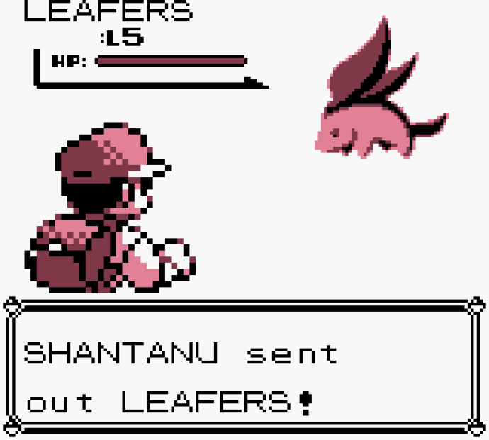

# Pokémon Leaf Edition

A rebuilt version of Pokémon Red, but with a [Khan Academy](https://khanacademy.org) theme!

Created at Khan Academy's 4th annual Healthy Hackathon. I created this once I noticed that someone had published a disassembled version of Pokémon and that Khan Academy avatars strongly resembled Pokémon.

# Playing

You can build the game from source; see [**INSTALL.md**](INSTALL.md). Building the game will result in `pokered.gbc` and `pokeblue.gbc`. Play either, whatever you like.

If you don't want to build from source, you can play the pre-built .gbc games in the [**dist**](/dist) folder. These might be a little
out-of-date.

For Macs, I recommend [OpenEmu](http://openemu.org/) for emulating these games.

# Screenshots

### New title screen

### Pokémon Prof. Salman Khan

### Avatars are Pokémon

### Choosing your name

### Choosing rival's name

### Exploring your hometown

### The new Pokémon lab

### The grass starter

### The water starter

### The fire starter

### Receiving your starter Pokémon

### Rival challenging you

### Rival battle

### Motivational quotes from Prof. Khan

### A wild Hopper

### A wild Oh Noes guy

